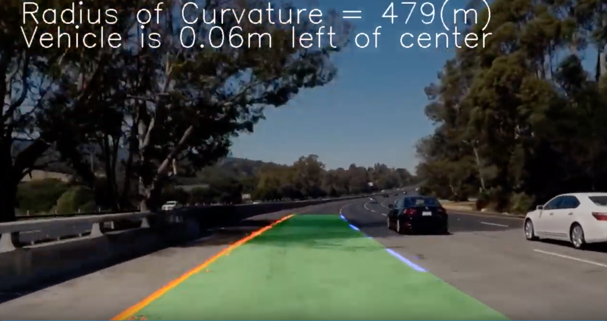

# Advanced Lane Finding

In this project we detect the lane lines under more challenging real conditions, including lane cruvatures, change of lighting and lane colors, shadows, and different road conditions. 

The **input** is camera videos of a vechicle driving on a highway and the **output** is the video annotated with and overlay that shows the detected lane, as well as detected readius of curvatures and the vehicle offset from center of the lane. 

Thre [writeup](https://github.com/zardosht/udacity_selfdriving_car/blob/master/P2_Advanced_Lane_Finding/writeup_template.md) explains steps of the pipeline in details. 

The requirements to pass the porject are listed [here](./P2_Project_Rubric.pdf)

The Project
---

The goals / steps of this project are the following:

* Compute the camera calibration matrix and distortion coefficients given a set of chessboard images.
* Apply a distortion correction to raw images.
* Use color transforms, gradients, etc., to create a thresholded binary image.
* Apply a perspective transform to rectify binary image ("birds-eye view").
* Detect lane pixels and fit to find the lane boundary.
* Determine the curvature of the lane and vehicle position with respect to center.
* Warp the detected lane boundaries back onto the original image.
* Output visual display of the lane boundaries and numerical estimation of lane curvature and vehicle position.

The images for camera calibration are stored in the folder called `camera_cal`.  The images in `test_images` are result of testing the pipeline on single frames.  The resulting imaages from each stage of the pipeline are stored in the folder called `output_images`. 

The pipeline is then applied to the `project_video.mp4` and the output is `project_video_output.mp4` 

I will also test the pipeline on `challenge_video.mp4` and the `harder_challenge.mp4` video. 

 

# Udacity Self-driving Car Nanodegree
Projects from Self-driving Car Engineer Nanodegree. 
Each project is in its corresponding folder. I have named the projects consecutively from P1 to P9. The program consists of two parts: 

  * Part 1: Computer Vision, Deep Learning, and Sensors (P1 to P5):
  	* Project 1: Finding Lane Lines
  	* Project 2: Advanced Lane Finding
  	* Project 3: Traffic Sign Classifier
  	* Project 4: Behavioral Cloning
  	* Project 5: Extended Kaman Filters 
  
  
  * Part 2: Localization, Path Planning, Control, and System Integration (P6 to P9): 
  	* Project 6: Localization
  	* Project 7: Path Planning
  	* Project 8: PID Controller
  	* Project 9: System Integration and Deployment

